# Developer Guide

This document covers the internal architecture of OpenNeuro for contributors and anyone building new components. For usage and quick start, see [README.md](README.md). For exhaustive API-level detail, see the wiki files in [dev-ignore/](dev-ignore/).

## Table of Contents

- [System Architecture](#system-architecture)
- [Backend](#backend)
  - [Component System](#component-system)
  - [Channel System](#channel-system)
  - [Frame Types](#frame-types)
  - [GraphManager](#graphmanager)
  - [API Layer](#api-layer)
- [Frontend](#frontend)
  - [Application Structure](#application-structure)
  - [Type Checking Engine](#type-checking-engine)
  - [Real-Time Data Flow](#real-time-data-flow)
- [Building a Component](#building-a-component)
- [Development Workflow](#development-workflow)
- [Further Reading](#further-reading)

---

## System Architecture

The system is split into a Python backend (runtime engine) and a React frontend (visual editor), connected by three protocols:

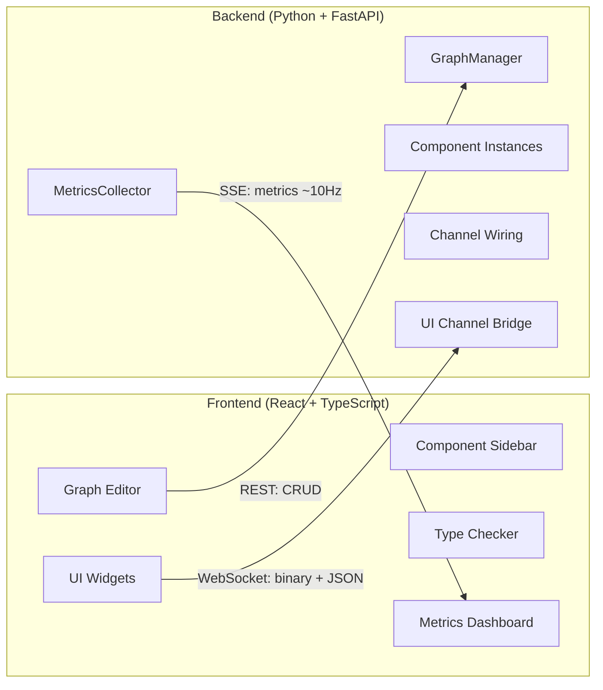

| Protocol | Endpoint | Purpose |
|----------|----------|---------|
| REST | `/graph/*`, `/component/*`, `/projects/*`, `/env`, `/logs/*` | Graph CRUD, component registry, project management |
| SSE | `GET /metrics` | Real-time metrics stream (~10 Hz) |
| WebSocket | `/ui/ws` | Bidirectional UI channels (video frames, text I/O) |

---

## Backend

### Component System

All processing nodes inherit from a single class hierarchy:

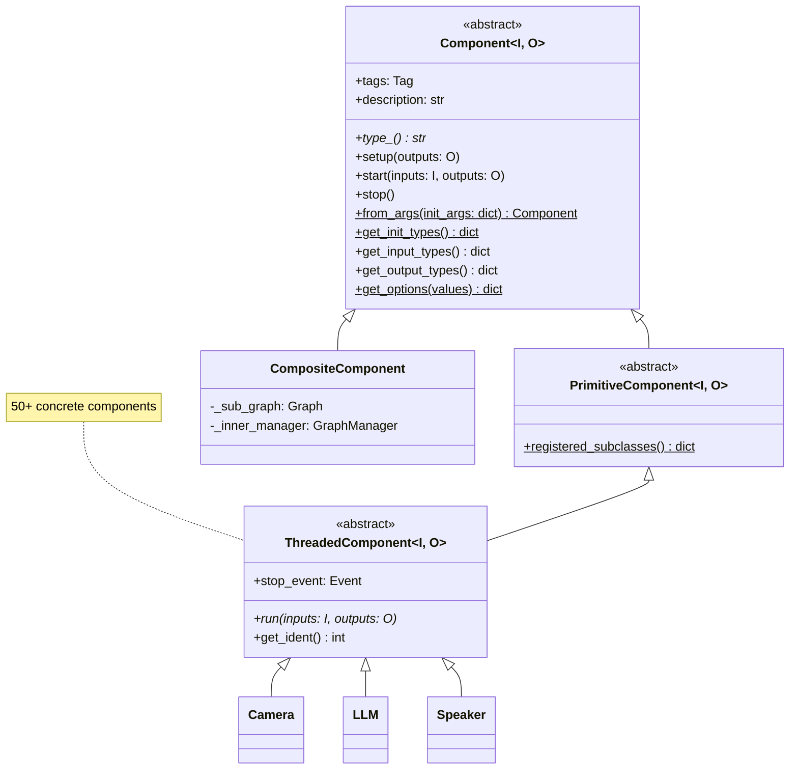

- **`I`** is a `NamedTuple` of `Receiver[T] | None` slots (inputs)
- **`O`** is a `NamedTuple` of `Sender[T] | None` slots (outputs)
- Generic parameters are captured at class definition and inspected at runtime for reflection
- Components are **auto-discovered** — place a file in `source/`, `conduit/`, or `sink/` and `registered_subclasses()` finds it

#### Component Lifecycle

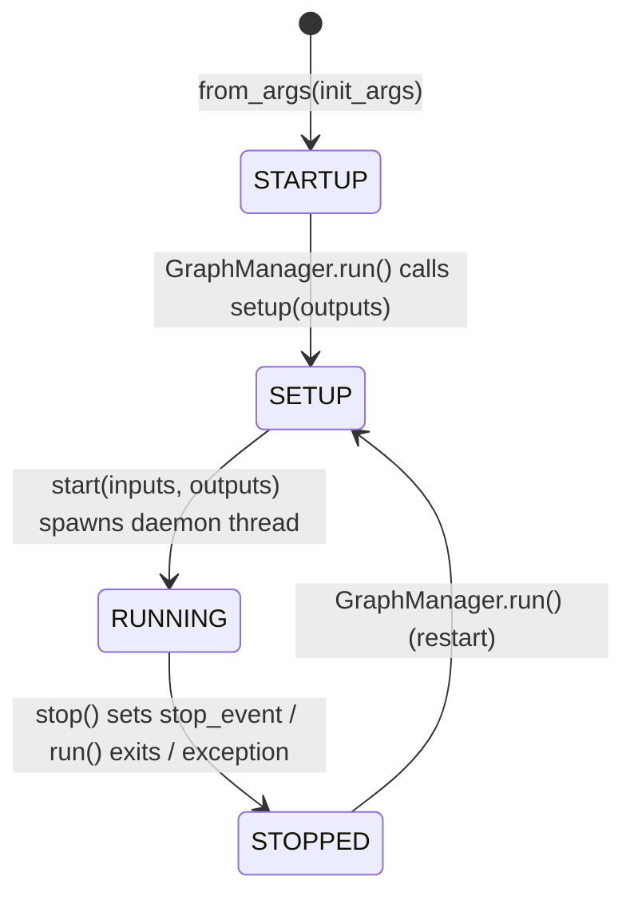

1. **STARTUP** — component is constructed via `from_args()` with deserialized config
2. **SETUP** — `setup(outputs)` is called synchronously before any thread starts; used to emit initial values (e.g., CharacterCard emits prompts here)
3. **RUNNING** — `start()` spawns a daemon thread running `run(inputs, outputs)`
4. **STOPPED** — `stop()` sets `_stop_event`, the thread checks it and exits

#### Tags

Each component declares metadata via `Tag`:

```python
class Tag(BaseModel):
    io: set[IOTag]              # "source" | "conduit" | "sink"
    functionality: set[FunctionalityTag]  # "audio" | "video" | "llm" | "image" | "movement" | "misc" | "other"
    gpu: set[GPUTag]            # "cpu" | "nvidia" | "apple" | "intel" | "amd"
```

Tags drive the frontend sidebar grouping, icon mapping, and color coding.

---

### Channel System

Components communicate exclusively through typed pub-sub channels. There is **no shared state** between components.

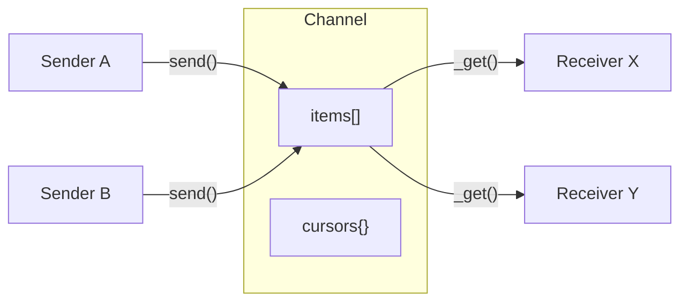

**`Channel[T]`** — thread-safe buffer with per-subscriber cursor tracking:
- Items are appended by senders, read by receivers at independent positions
- `threading.Condition` for blocking waits with 0.1s poll
- Garbage collection trims items that all subscribers have consumed

**`Sender[T]`** — broadcasts to zero or more channels:
- Tracks `_msg_count`, `_byte_count`, `_last_send_time`, `buffer_depth` for metrics
- `_stopped` flag makes `send()` a no-op after pipeline stop

**`Receiver[T]`** — reads from one channel as an iterator:
- **Blocking mode** (default): blocks on `__next__()` until data arrives or `stop_event` fires
- **Non-blocking mode**: returns `None` immediately if no data
- **Newest mode**: fast-forwards cursor to latest item (essential for video to prevent lag)
- Tracks `_msg_count`, `_byte_count`, `lag` for metrics

#### Channel Reconciliation

When edges are added/removed, `GraphManager._reconcile()` recomputes the optimal channel layout:

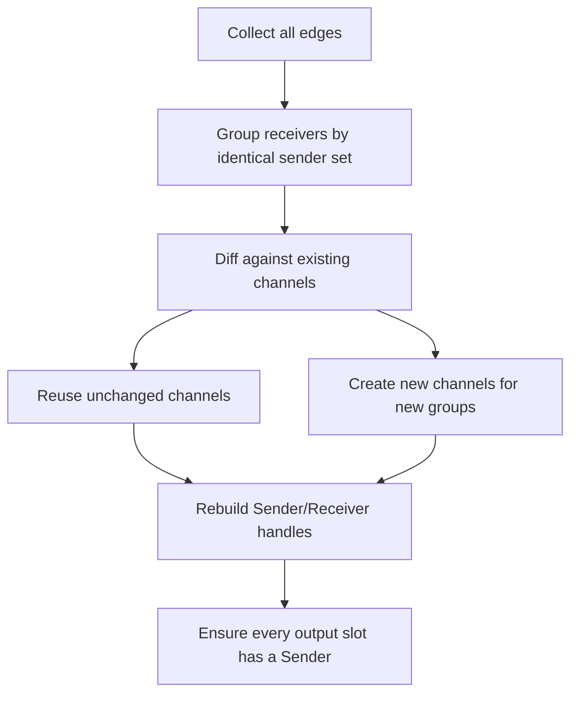

Receivers sharing the same set of upstream senders share a single `Channel` instance, minimizing memory and synchronization overhead.

#### UI Channels

UI channels are type-system markers that route data to/from the WebSocket instead of inter-component edges:

| Marker Class | Direction | Use Case |
|---|---|---|
| `UITextSender` | component → frontend | Display text in node UI |
| `UIVideoSender` | component → frontend | Display JPEG video in node UI |
| `UITextReceiver` | frontend → component | Text input from node UI |
| `UIKeystrokeReceiver` | frontend → component | Individual keystrokes from node UI |

---

### Frame Types

All frames are **frozen dataclasses with `__slots__`** (immutable). Each carries `pts: int` (nanosecond timestamp) and `id: int` (unique). Created via `.new()` classmethods.

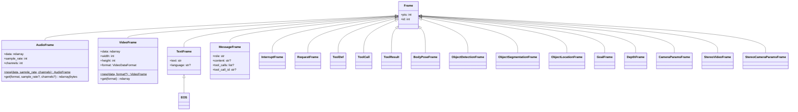

Key design decisions:
- **AudioFrame** stores canonical `(channels, samples)` float32 in `[-1.0, 1.0]`. The `.get()` method does on-the-fly resampling, rechanneling, and PCM conversion — no allocation at construction time.
- **VideoFrame** stores raw `ndarray` (H x W x 3/4). Encoding to JPEG/PNG is a sink concern, not a frame concern.
- **EOS** extends `TextFrame` so it passes through `Receiver[TextFrame | EOS]` channels. `EOS.END` is a singleton sentinel.
- **InterruptFrame** carries a `reason: str` and propagates cancellation across components (e.g., user starts speaking mid-TTS).

---

### GraphManager

The `GraphManager` is the runtime orchestrator. It owns the graph definition, component instances, and all channel/handle state.

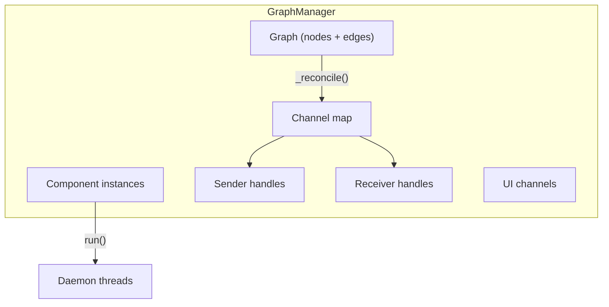

#### Pipeline Execution

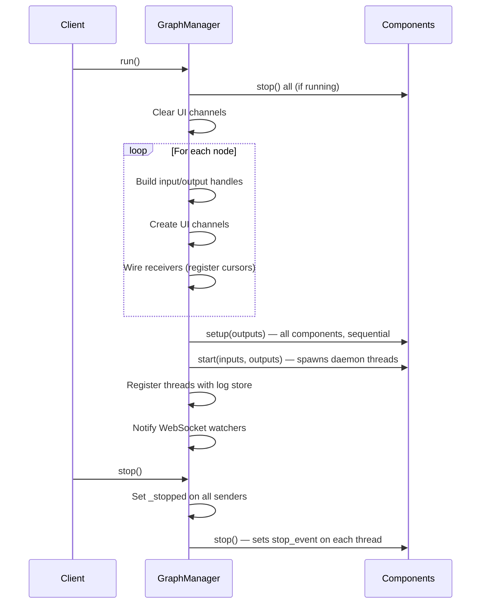

#### Node CRUD

| Method | Effect |
|---|---|
| `add_node(type, init_args)` | Instantiate component, add to graph, reconcile channels |
| `delete_node(id)` | Stop component + connected neighbors, remove edges, reconcile |
| `update_node_init_args(id, args)` | Recreate component; if graph was running, auto-restart (hot-reload) |
| `add_edge(edge)` / `delete_edge(edge)` | Modify graph topology, reconcile channels |
| `reset(graph)` | Replace entire graph — stop everything, re-instantiate all components |

---

### API Layer

Routes follow a **Controller → Service → GraphManager** pattern. DTOs are Pydantic `BaseModel`s.

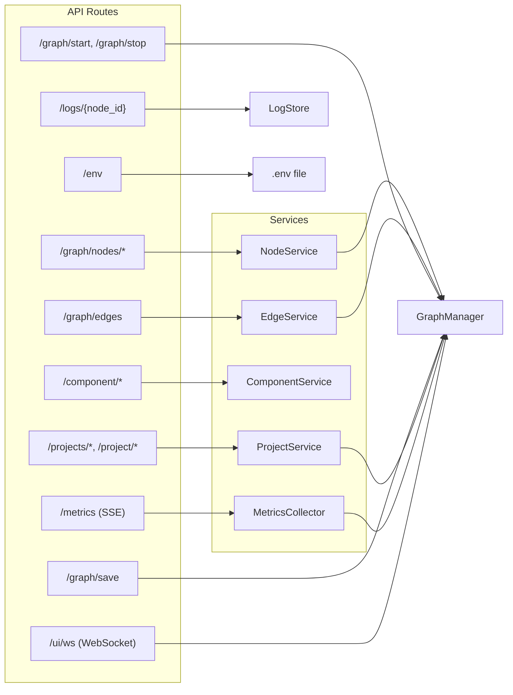

Key endpoints:

| Method | Path | Purpose |
|---|---|---|
| `GET` | `/graph/nodes` | List all nodes |
| `POST` | `/graph/nodes` | Create node |
| `PATCH` | `/graph/nodes/{id}/init-args` | Update config (hot-reload) |
| `DELETE` | `/graph/nodes/{id}` | Delete node |
| `POST/DELETE` | `/graph/edges` | Add/remove edge |
| `POST` | `/graph/start` / `/graph/stop` | Start/stop pipeline |
| `POST` | `/graph/save` | Persist to disk |
| `GET` | `/component` | List all available component types |
| `GET` | `/component/is-subtype?sub=&sup=` | Type compatibility check (used by frontend) |
| `GET` | `/metrics` | SSE stream of per-node metrics |
| `GET` | `/logs/{node_id}` | Component stdout/stderr logs |
| `WS` | `/ui/ws` | Bidirectional UI channel bridge |

---

## Frontend

### Application Structure

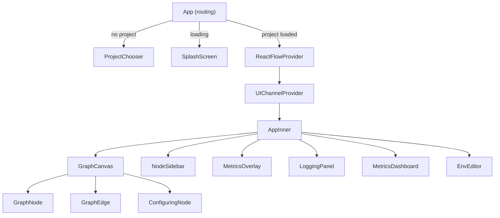

**State management** is local React hooks — no Redux or Zustand. ReactFlow manages node/edge state via `useNodesState` / `useEdgesState`. A single `UIChannelContext` provides the WebSocket manager.

**Key hooks:**

| Hook | Purpose |
|---|---|
| `useComponents()` | Fetch component registry from backend |
| `useGraphData(components)` | SSE metrics stream + component map |
| `useMetricsHistory(snapshot)` | Circular buffer of 60 snapshots for waveforms |
| `useUIChannelManager()` | WebSocket connection with auto-reconnect |
| `useUIInput(nodeId, channel)` | Send data to component UI input |
| `useUIOutput(nodeId, channel)` | Subscribe to component UI output |
| `useUIVideoOutput(nodeId, channel)` | ArrayBuffer → Blob URL for `` |
| `useComponentLogs(nodeId)` | Poll component logs every 500ms |

---

### Type Checking Engine

The frontend implements **algebraic subtyping** (Parreaux, Simple-sub, ICFP 2020) to validate edge connections in real time.

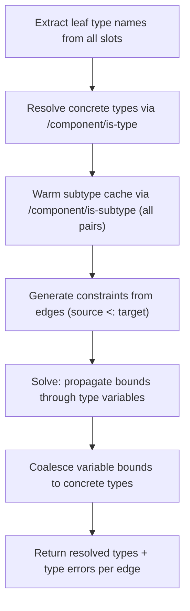

**Type AST:**
```typescript
type Type =
  | { kind: "concrete"; name: string }        // AudioFrame, TextFrame, etc.
  | { kind: "var"; name: string }              // type variable (scoped as "nodeId.T")
  | { kind: "union"; types: Type[] }           // A | B
  | { kind: "constructor"; name: string; inner: Type }  // List[T], Sender[T], etc.
```

This enables generic components like `Passthrough[T]` and `Buffer[T]` to have their type variables resolved from connected edges — e.g., connecting an `AudioFrame` output to a `Passthrough[T]` input resolves `T = AudioFrame` across all its slots.

---

### Real-Time Data Flow

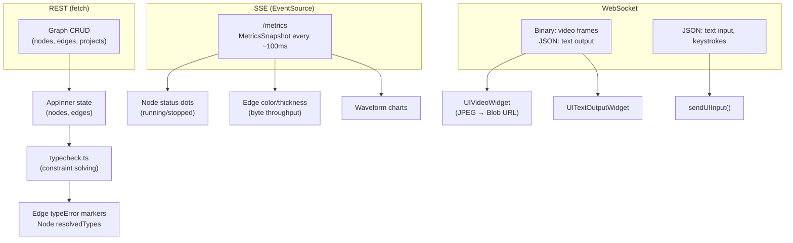

Every graph mutation follows the pattern: **API call → update local state → run type check → save graph**.

---

## Building a Component

### Minimal Example

```python
from typing import NamedTuple
from src.core.channel import Sender, Receiver
from src.core.component import ThreadedComponent, Tag
from src.core.frames import AudioFrame, TextFrame

class MyInputs(NamedTuple):
    audio: Receiver[AudioFrame]

class MyOutputs(NamedTuple):
    result: Sender[TextFrame]

class MyComponent(ThreadedComponent[MyInputs, MyOutputs]):
    tags = Tag(io={"conduit"}, functionality={"audio"})
    description = "Describe what this does"

    def run(self, inputs: MyInputs, outputs: MyOutputs) -> None:
        for frame in inputs.audio:
            if self.stop_event.is_set():
                break
            outputs.result.send(TextFrame.new(text=f"{frame.sample_rate}Hz"))
```

Place the file in `backend/src/core/conduit/` (or `source/` / `sink/`). It is auto-discovered — no registration needed.

### Patterns

#### Optional Slots

```python
class MyInputs(NamedTuple):
    audio: Receiver[AudioFrame]
    text: Receiver[TextFrame] | None   # None when no edge connected

# In run():
if inputs.text is not None:
    for frame in inputs.text:
        ...
```

#### Newest-Only Reads (Video)

```python
def run(self, inputs, outputs):
    inputs.video.newest = True  # always grab the latest frame, skip old ones
    for frame in inputs.video:
        ...
```

#### Non-Blocking Reads (Polling)

```python
inputs.vision.blocking = False
inputs.vision.newest = True
frame = next(inputs.vision)  # returns None immediately if no data
```

#### Interrupt Handling

```python
class MyInputs(NamedTuple):
    text: Receiver[TextFrame]
    interrupt: Receiver[InterruptFrame] | None = None

def run(self, inputs, outputs):
    if inputs.interrupt is not None:
        inputs.interrupt.blocking = False
    for frame in inputs.text:
        # Check for interrupts
        if inputs.interrupt is not None:
            irq = next(inputs.interrupt)
            if irq is not None:
                cancel_current_work()
```

#### Worker Thread Pattern (for blocking API calls)

Components like LLM, ASR, and TTS use a separate worker thread with a task queue:

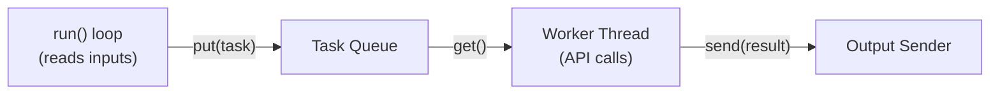

A generation counter handles interrupt/cancellation — when an interrupt arrives, increment the generation; the worker discards results from stale generations.

#### Config with Pydantic

```python
from pydantic import BaseModel

class MyConfig(BaseModel):
    model: str = "default"
    threshold: float = 0.5

class MyComponent(ThreadedComponent[MyInputs, MyOutputs]):
    def __init__(self, config: MyConfig = MyConfig()) -> None:
        super().__init__()
        self.config = config
```

The frontend auto-generates a configuration form from the JSON Schema of the config model.

#### Dynamic Config Options

Override `get_options()` to populate dropdowns dynamically (e.g., camera device list, voice list):

```python
@classmethod
def get_options(cls, values: dict[str, Any]) -> dict[str, Any]:
    return {"config": {"model": [
        {"value": "a", "label": "Model A"},
        {"value": "b", "label": "Model B"},
    ]}}
```

#### UI Channels

Add UI channel markers to your I/O to render widgets in the node:

```python
from src.core.channel import UITextSender, UIVideoSender, UITextReceiver

class MyOutputs(NamedTuple):
    result: Sender[TextFrame]
    ui_display: UITextSender      # text display in node UI
    ui_video: UIVideoSender       # video feed in node UI

class MyInputs(NamedTuple):
    ui_text: UITextReceiver       # text input from node UI
```

These are automatically routed through the WebSocket instead of inter-component edges.

---

## Development Workflow

### Backend

```bash
cd backend
uv sync                                # install dependencies
uv run python -m src.main              # start API server on :8000
uv run ruff check .                    # lint
uv run ruff format .                   # auto-format
uv run mypy .                          # type check
uv run python -m pytest                # run all tests
uv run python -m pytest tests/test_foo.py::test_bar  # single test
```

### Frontend

```bash
cd frontend
bun install                            # install dependencies
bun run dev                            # vite dev server on :5173
bun run build                          # production build
bun run test                           # run tests
```

### Full Stack

```bash
bun run dev     # from repo root — starts both backend + frontend
```

### CI

GitHub Actions runs on PRs to `main`:
- **typecheck_lint.yml** — ruff format check, ruff lint, mypy (Python 3.13)
- **coverage.yml** — pytest with coverage
- **build.yml** — cross-platform Tauri build

---

## Further Reading

| Resource | Description |
|---|---|
| [README.md](README.md) | Project overview, quick start, component catalogue |
| [dev-ignore/backend_wiki.md](dev-ignore/backend_wiki.md) | Exhaustive backend API reference (every method, every field) |
| [dev-ignore/frontend_wiki.md](dev-ignore/frontend_wiki.md) | Exhaustive frontend reference (every hook, every component) |
| [project/docs/system_design.md](project/docs/system_design.md) | System design document |
| [docs/developer-guide/](docs/developer-guide/) | MDX developer guide (architecture, channels, frames, etc.) |
