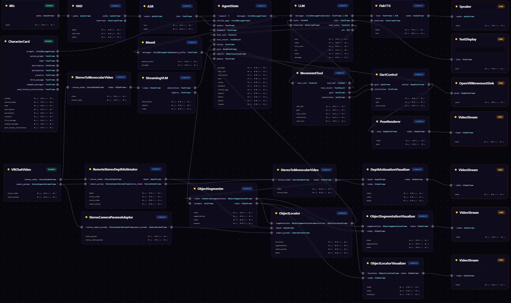
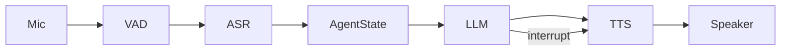
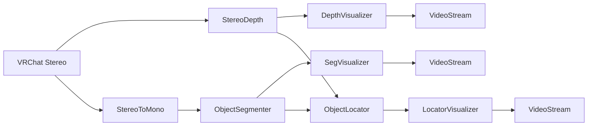
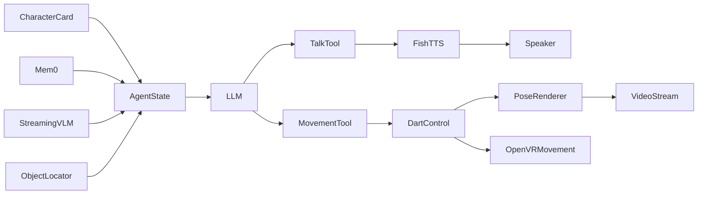
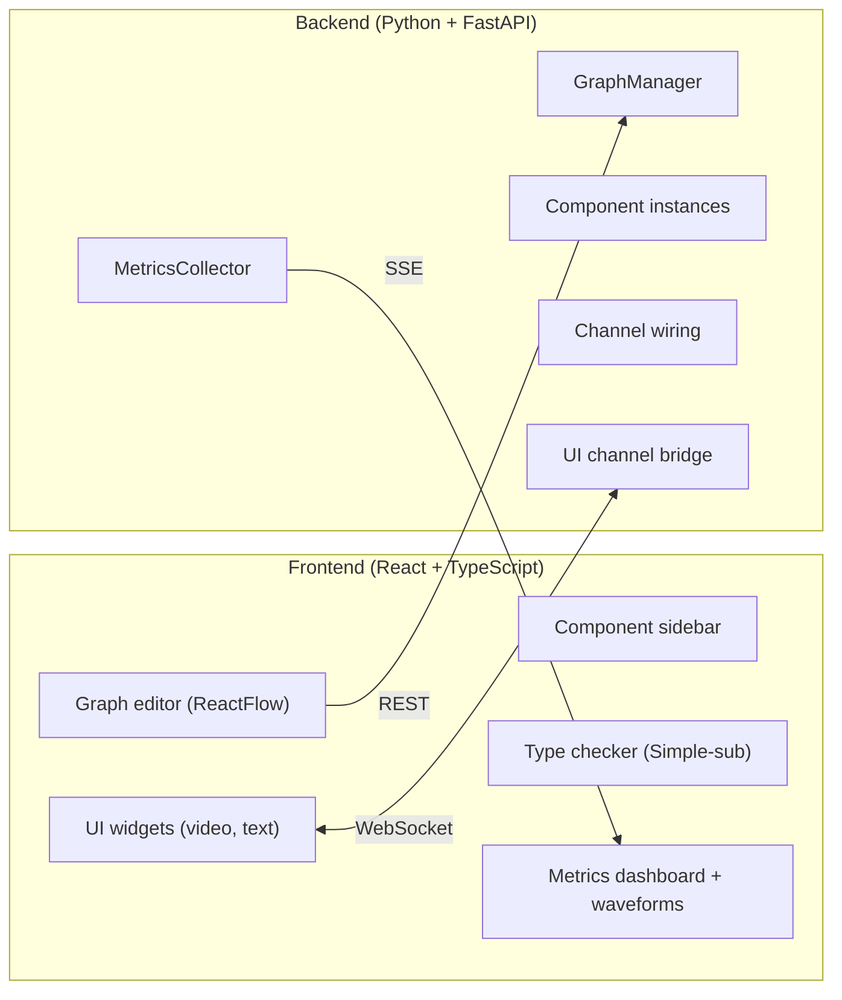

## Notes To The Grading TA:
- Assignment PDFs are in their corresponding `./a{1..5}` directories.
- The main codebase lives in the [repos/OpenNeuro](repos/OpenNeuro) submodule (This is pointing to a commit before the deadline which we submit for our project).
- For the full internal architecture, channel system, frame types, API reference, and frontend details, see **[DEVELOPER.md](DEVELOPER.md)**.
- To view the full contribution history, please visit our **[OpenNeuro](https://github.com/Project-NEURIA/OpenNeuro)** repo

# OpenNeuro

A visual node-graph system for building real-time embodied virtual characters and multimodal AI agents.

<p align="center">
  
</p>

Existing avatar and NPC platforms are typically optimized for dialogue-centric interactions, engine-specific SDKs, or narrow deployment targets. Perception, spatial reasoning, and locomotion — when supported at all — are treated as downstream add-ons rather than first-class components of the same interactive loop. This fragmentation makes it difficult to build characters that simultaneously perceive, remember, and act within a persistent world.

OpenNeuro addresses this systems gap. It unifies speech, vision, 3D grounding, motion generation, and persistent memory within a single modular runtime built on a **generalized typed Kahn process network** — components are deterministic sequential processes communicating through typed FIFO channels with cursor-based fan-out, multi-rate streaming, and static interface checking. The result is a composable foundation where character behaviors are built, inspected, and reconfigured as graph programs spanning perception, cognition, and control.

**Key contributions:**
- A modular node-graph architecture integrating speech, vision, motion, and memory in one real-time workflow
- An online open-vocabulary binocular 3D grounding pipeline combining prompted segmentation (YOLOE), stereo depth (Fast Foundation Stereo), and goal-conditioned motion generation (DART)
- A generalized typed-runtime design with static channel typing, efficient fan-out, and hierarchical subgraph composition
- A visual editor with algebraic subtyping, live metrics, and embedded UI widgets

## What It Does

OpenNeuro lets you wire together processing components as a visual graph:

- **Speech pipeline**: Mic → VAD → ASR → LLM → TTS → Speaker, with interrupt handling and turn-taking
- **Vision pipeline**: Stereo camera → Depth estimation → Object segmentation → 3D localization
- **Motion pipeline**: Goal-conditioned motion generation → Full-body pose → VR avatar control
- **Agent pipeline**: Character persona + memory retrieval + tool use + conversation history

All of these can run simultaneously in a single graph, sharing components where appropriate.

**Speech pipeline** — real-time voice conversation with interrupt handling:



**Vision pipeline** — stereo depth, segmentation, and 3D object localization:



**Agent pipeline** — persona, memory, tool use, and motion all wired into a single conversation loop:



## Features

- **50+ built-in components** spanning audio, video, LLM, vision, motion, and I/O
- **Visual node editor** with drag-and-drop, live wiring, and auto-generated configuration forms
- **Static type checking** — edges are validated in real time using algebraic subtyping (Simple-sub)
- **Live metrics** — per-channel message throughput, byte throughput, buffer depth, and lag displayed on every node and edge
- **Multi-rate streaming** — components run at independent rates; newest-only reads prevent lag accumulation on video pipelines
- **Embedded UI widgets** — video previews, text displays, and text inputs render directly inside nodes
- **Subgraph composition** — group nodes into reusable composite components
- **Project management** — save, load, and share graphs as portable JSON files
- **Hot-reload** — reconfigure components while the pipeline is running
- **Tauri desktop app** — runs as a native app on macOS, Windows, and Linux

## Quick Start

### Prerequisites

- [Python](https://www.python.org/) 3.13+
- [uv](https://docs.astral.sh/uv/) (Python package manager)
- [Bun](https://bun.sh/) (JavaScript runtime)

### Install & Run

If you want to use the VR related components, you must install our custom VR driver at https://github.com/Project-NEURIA/openvr-virtual-driver 


```bash
# Install dependencies (first time only)
cd backend && uv sync && cd ..
cd frontend && bun install && cd ..

# Start both backend + frontend
bun run dev
```

This runs the backend (FastAPI on `:8000`) and frontend (Vite on `:5173`) concurrently.

### Or start each service separately

**Backend:**

```bash
cd backend
uv sync                       # install dependencies
uv run python -m src.main     # start API server on :8000
```

**Frontend:**

```bash
cd frontend
bun install                   # install dependencies
bun run dev                   # vite dev server on :5173 (proxies API to :8000)
```

Then open [http://localhost:5173](http://localhost:5173) in your browser.

> **Note:** Most cloud-backed components (LLM, ASR, TTS, etc.) require API keys. Click the key icon in the top-right toolbar to configure them, or see [Environment Variables](#environment-variables) below.

### GPU Support

Components that use PyTorch (DartControl, ObjectDetector, MonocularDepthEstimator, etc.) automatically select the best available device:

| Platform | Accelerator |
|----------|-------------|
| NVIDIA GPU | CUDA (with bfloat16 where supported) |
| Apple Silicon | MPS |
| AMD GPU | ROCm (mapped to CUDA) |
| Fallback | CPU |

On **macOS** (including Apple Silicon), the default `uv sync` installs CPU/MPS-compatible wheels — no extra steps needed.

For **NVIDIA GPUs** on Linux/Windows, install the CUDA-enabled PyTorch wheels:

```bash
cd backend
uv sync --group cuda12
```

For **AMD GPUs** (ROCm), PyTorch's ROCm builds are mapped to `cuda` internally — install the appropriate ROCm wheels for your platform.

### Environment Variables

API keys for cloud services are configured through the in-app environment editor (the key icon in the top-right toolbar), or by creating a `.env` file at `~/Documents/OpenNeuro/.env`:

```env
OPENAI_API_KEY=sk-...
GROQ_API_KEY=gsk_...
FISH_API_KEY=...
```

## Architecture



**Three communication protocols, each for its natural use case:**

| Protocol | Endpoint | Purpose |
|----------|----------|---------|
| REST | `/graph/*`, `/component/*`, `/projects/*` | Graph CRUD, project management, component registry |
| SSE | `/metrics` | Real-time metrics stream (~10 Hz) |
| WebSocket | `/ui/ws` | Bidirectional UI channels (video frames + text I/O) |

The runtime is a **generalized Kahn process network** — components are deterministic sequential processes communicating through typed FIFO channels with cursor-based fan-out, non-blocking reads, and newest-only reads for multi-rate support.

For full architectural details, see [project/docs/system_design.md](project/docs/system_design.md).

## Components

### Sources (produce data)

| Component | Description |
|-----------|-------------|
| **Mic** | Microphone audio capture via sounddevice |
| **Camera** | Webcam video capture with device enumeration |
| **VideoPlayer** | Video file playback (looping) |
| **TextInput** | Text input from the node UI |
| **Pulse** | Periodic trigger at configurable interval |
| **PromptRepeater** | Repeats a static prompt at interval |
| **VRChatVideo** | Stereo video + camera params from OpenVR |
| **OpenVRPlayer** | Interactive first-person VR control (keyboard/mouse) |
| **DummyPosesInput** | Synthetic body poses for testing |

### Conduits (processing)

**LLM & Agent**

| Component | Description |
|-----------|-------------|
| **LLM** | Streaming text generation via litellm (any OpenAI-compatible model) |
| **AgentState** | Conversation history manager with multi-input context assembly |
| **CharacterCard** | Persona conditioning (manual config or SillyTavern PNG import) |
| **Mem0** | Persistent vector memory via mem0ai |

**Audio**

| Component | Description |
|-----------|-------------|
| **ASR** | Speech recognition via Groq Whisper API |
| **TTS** | Text-to-speech via Inworld API (streaming) |
| **FishTTS** | Text-to-speech via Fish Audio API |
| **QwenTTS** | Local Qwen3 TTS model |
| **VAD** | Voice activity detection (Silero + Smart Turn) |
| **STS** | Speech-to-speech via OpenAI Realtime API |
| **DiscordIO** | Bidirectional audio via Discord voice channels |

**Vision & Detection**

| Component | Description |
|-----------|-------------|
| **ObjectDetector** | SAM3 grounded object detection + tracking |
| **ObjectSegmenter** | YOLO instance segmentation |
| **ObjectLocator** | 3D world position from segmentation + depth + camera params |
| **MonocularDepthEstimator** | Depth Anything 3 metric depth |
| **StereoDepthEstimator** | Fast Foundation Stereo binocular depth |
| **RemoteStereoDepthEstimator** | Remote stereo depth via WebSocket |
| **StreamingVLM** | Real-time vision-language captioning (OpenAI Vision API) |
| **StereoToMonocularVideo** | Extract one eye from stereo video pair |
| **StereoCameraParamsAdapter** | Convert stereo camera params to mono |

**Motion**

| Component | Description |
|-----------|-------------|
| **DartControl** | Diffusion-based text- and goal-conditioned motion generation |

**Tools** (for agent function calling)

| Component | Description |
|-----------|-------------|
| **TalkTool** | Agent "speak" tool — extracts text for TTS |
| **ThinkTool** | Agent internal scratchpad |
| **MovementTool** | Agent "move" tool — emits GoalFrame for DartControl |
| **StopTool** | Agent stop signal |
| **DoNothingTool** | No-op (always returns success) |

**Visualization**

| Component | Description |
|-----------|-------------|
| **PoseRenderer** | 2D skeleton overlay on video |
| **PoseRenderer3D** | 3D SMPL mesh render |
| **ObjectDetectionVisualizer** | Bounding box overlay |
| **ObjectSegmentationVisualizer** | Mask overlay |
| **DepthEstimationVisualizer** | Colorized depth overlay |
| **ObjectLocatorVisualizer** | 3D position labels on video |

**Utilities**

| Component | Description |
|-----------|-------------|
| **Passthrough\[T\]** | Generic identity relay |
| **Buffer\[T\]** | Accumulate frames until EOS, then emit batch |
| **Throttle\[T\]** | Rate-limit to fixed interval (newest mode) |
| **MessagesToText** | Format message history as plain text |

### Sinks (consume data)

| Component | Description |
|-----------|-------------|
| **Speaker** | Audio playback via sounddevice |
| **VideoStream** | JPEG video stream to node UI |
| **TextDisplay** | Text display in node UI |
| **OSCFace** | VRChat facial animation via OSC (with emotion detection) |
| **OSCChatbox** | VRChat chatbox via OSC (sentence-aware splitting) |
| **OpenVRMovementSink** | Full-body pose to OpenVR driver |
| **DoNothing\[T\]** | Discard input (useful for testing) |

### ML Models

Many components wrap ML models that run either locally (GPU/CPU) or via cloud APIs. All models listed below are defaults — most can be swapped via component config.

**Self-hosted (local inference)**

| Component | Model | Framework | Task |
|-----------|-------|-----------|------|
| **VAD** | Silero VAD + Smart Turn v3.0 | torch + ONNX Runtime | Voice activity & turn-end detection |
| **QwenTTS** | Qwen/Qwen3-TTS-12Hz-0.6B-Base | torch + transformers | Text-to-speech with voice cloning |
| **ObjectDetector** | facebook/sam3 | transformers | Text-prompted object detection & tracking |
| **ObjectSegmenter** | YOLOE-26 (s/m/l/x) | torch (ultralytics) | Open-vocabulary instance segmentation |
| **MonocularDepthEstimator** | Depth Anything 3 (DA3-METRIC-LARGE) | transformers | Metric depth from single RGB |
| **StereoDepthEstimator** | Fast Foundation Stereo | torch | Metric depth from stereo pairs |
| **DartControl** | CLIP (ViT-B/32) + Diffusion VAE | torch + CLIP | Text- and goal-conditioned motion generation |
| **PoseRenderer3D** | SMPL body model | torch + pyrender | 3D mesh rendering from body poses |

**API-based (cloud inference)**

| Component | Default Model | API | Task |
|-----------|---------------|-----|------|
| **LLM** | groq/llama-3.3-70b-versatile | litellm (any OpenAI-compatible) | Streaming text generation + tool calls |
| **ASR** | whisper-large-v3-turbo | Groq API | Speech-to-text |
| **TTS** | inworld-tts-1.5-max | Inworld API | Streaming text-to-speech |
| **FishTTS** | s2-pro | Fish Audio API | Streaming text-to-speech |
| **STS** | gpt-4o-realtime-preview | OpenAI Realtime API | End-to-end speech-to-speech |
| **StreamingVLM** | gpt-4o (configurable) | OpenAI Vision API | Real-time video captioning |
| **Mem0** | gpt-4.1-nano + text-embedding-3-small | OpenAI API + Qdrant | Long-term memory retrieval |

## Building a New Component

Create a Python file in `backend/src/core/source/`, `conduit/`, or `sink/`. The component is auto-discovered — no registration needed.

```python
from typing import NamedTuple
from pydantic import BaseModel
from src.core.channel import Sender, Receiver
from src.core.component import ThreadedComponent, Tag
from src.core.frames import AudioFrame, TextFrame

# 1. Define I/O
class MyInputs(NamedTuple):
    audio: Receiver[AudioFrame]
    text: Receiver[TextFrame] | None   # optional slot

class MyOutputs(NamedTuple):
    result: Sender[TextFrame]

# 2. Optional: define config
class MyConfig(BaseModel):
    threshold: float = 0.5

# 3. Implement
class MyComponent(ThreadedComponent[MyInputs, MyOutputs]):
    tags = Tag(io={"conduit"}, functionality={"audio"})
    description = "Processes audio with an optional text trigger"

    def __init__(self, config: MyConfig = MyConfig()) -> None:
        super().__init__()
        self.config = config

    def run(self, inputs: MyInputs, outputs: MyOutputs) -> None:
        for frame in inputs.audio:
            if self.stop_event.is_set():
                break
            outputs.result.send(TextFrame.new(text=f"Processed: {frame.sample_rate}Hz"))
```

Key patterns:

- **Optional slots**: Use `Receiver[T] | None`. Check `if inputs.text is not None` before iterating.
- **Newest-only reads**: Set `inputs.video.newest = True` to skip stale frames (essential for video).
- **Non-blocking reads**: Set `inputs.text.blocking = False` to poll without waiting.
- **Interrupt handling**: Check an `InterruptFrame | None` input in non-blocking mode.
- **Dynamic config options**: Override `get_options(values)` to populate dropdowns (e.g., camera device list).
- **UI channels**: Add `UITextSender`, `UIVideoSender`, `UITextReceiver` to your I/O NamedTuples.

For the full internal architecture, channel system, frame types, API reference, and frontend details, see **[DEVELOPER.md](DEVELOPER.md)**.

## Development

### Backend

```bash
cd backend
uv run ruff check .               # lint
uv run ruff format .               # auto-format
uv run mypy .                      # type check
uv run python -m pytest            # run all tests
uv run python -m pytest tests/test_foo.py::test_bar  # single test
```

### Frontend

```bash
cd frontend
bun run build                      # production build
bun run test                       # run tests
```

### CI

GitHub Actions runs on PRs to `main`:
- `typecheck_lint.yml` — ruff format check, ruff lint, mypy (Python 3.13)
- `coverage.yml` — pytest with coverage
- `build.yml` — cross-platform Tauri build

## Project Structure

```
OpenNeuro/
  backend/
    src/
      main.py                      # FastAPI app entry point
      core/
        component.py               # Component[I,O] class hierarchy
        channel.py                 # Channel / Sender / Receiver
        frames.py                  # Frame types (AudioFrame, VideoFrame, ...)
        graph.py                   # GraphManager (orchestrates everything)
        source/                    # Source components
        conduit/                   # Conduit components
        sink/                      # Sink components
      api/                         # REST/SSE/WS endpoints
    tests/                         # pytest tests
  frontend/
    src/
      App.tsx                      # Root component
      lib/
        api.ts                     # REST client
        types.ts                   # TypeScript interfaces
        typecheck.ts               # Simple-sub type inference
      hooks/                       # React hooks (SSE, WebSocket, metrics)
      components/
        graph/                     # Node editor components
        metrics/                   # Metrics dashboard + waveforms
        project/                   # Project chooser
  scripts/
    dev.ts                         # Bun script: starts backend + frontend
  project/
    docs/
      system_design.md             # Full system design document
```

## Data Storage

| Path | Contents |
|------|----------|
| `~/Documents/OpenNeuro/projects/{name}/graph.json` | Saved project graphs |
| `~/Documents/OpenNeuro/projects/{name}/thumbnail.png` | Project thumbnails |
| `~/Documents/OpenNeuro/config.json` | App config (current project) |
| `~/Documents/OpenNeuro/.env` | API keys and environment variables |

## License

MIT License. See [LICENSE](LICENSE) for details.
